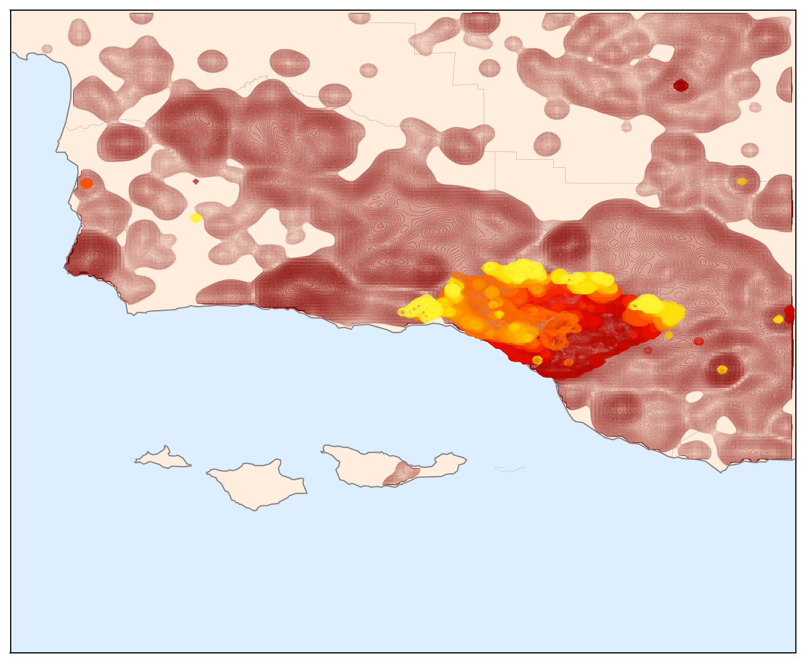
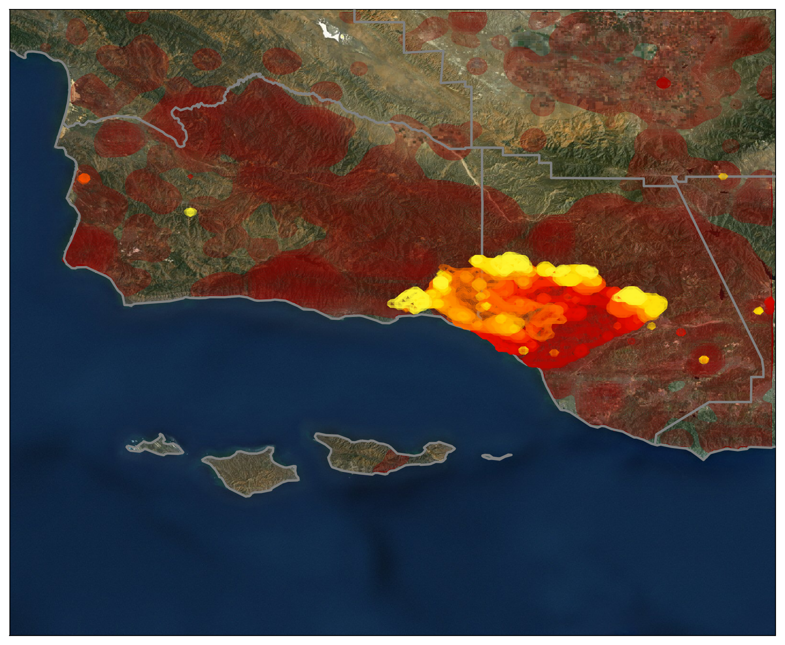

What do you do when you have to evacuate your house due to a wildfire?  Obsessively check its progress, of course!

Accordingly, this is a quick project to map the progess of the [*Thomas Fire*](https://en.wikipedia.org/wiki/Thomas_Fire), using data from NASA's MODIS and VIIRS satellites.

Color shows the progression of the fire, going from red to yellow.
In dark red, I show all of the previous fires from the past decade or so.
You can see that nearly the entire region has burned in the recent past; even so, the Thomas fire is unprecedented.

