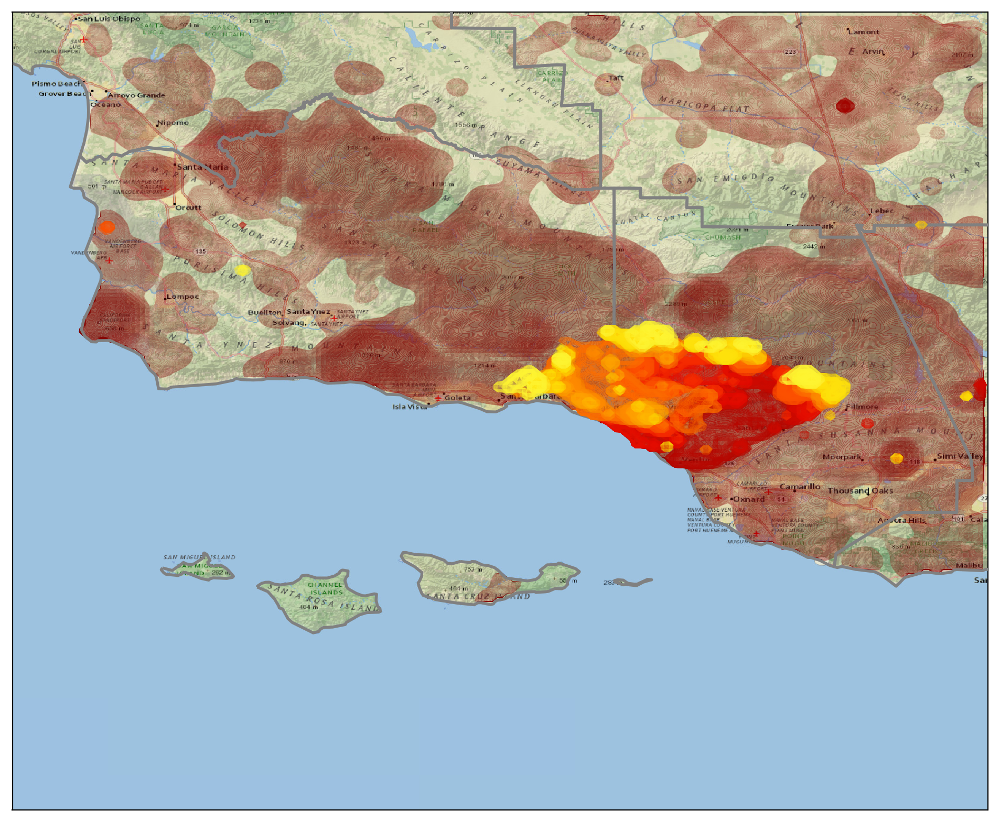
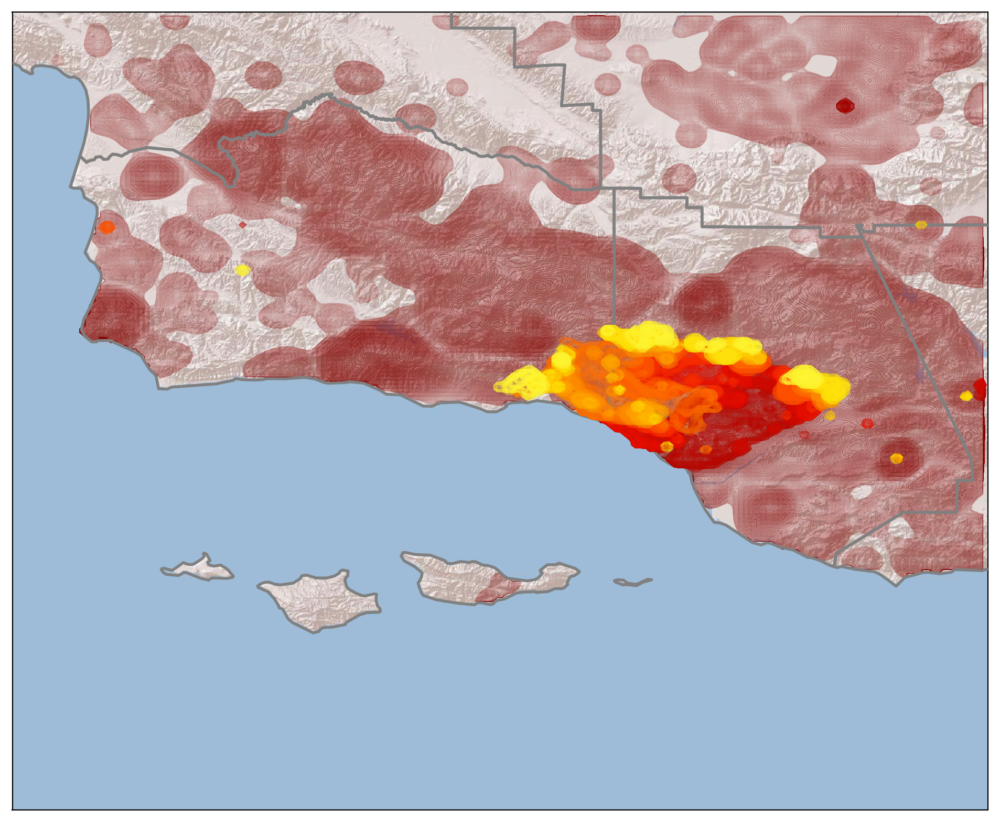

What do you do when you have to evacuate your house due to a wildfire?  Obsessively check its progress, of course!

Accordingly, this is a quick project to map the progess of the [*Thomas Fire*](https://en.wikipedia.org/wiki/Thomas_Fire), using data from NASA's MODIS and VIIRS satellites.

Color shows the progression of the fire, going from red to yellow.
In dark red, I show all of the previous fires from the past decade or so.
You can see that nearly the entire region has burned in the recent past; even so, the Thomas fire is unprecedented.

Here it is on the National Geographic map of the region:

on NASA's *Blue Marble* image of Earth:

and on a shaded relief map:

... and a zoom-in on where I live, as of 6pm on 12/16:

If you want to read the code, you can see it [here](https://nbviewer.jupyter.org/github/mkmcc/ThomasFire/blob/master/Thomas%20Fire.ipynb).

**Note:** *please don't use this for any kind of emergency planning or preparation!*
I'm using data from NASA's satellites, which can be 1-2 days old by the time it becomes available, and on top of that I'm only updating these maps ~once per day.
My only aim is to show the scope of the fire; check your local fire department, sheriff's department, and news stations for up-to-date information.
